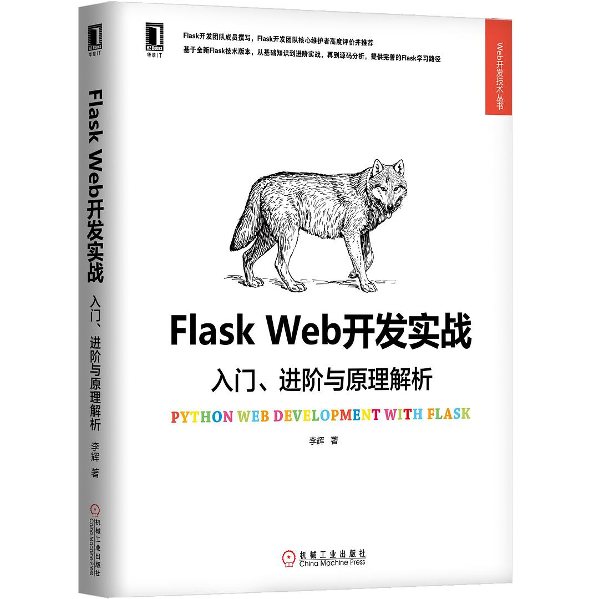

# Flask学习笔记

主要参考书籍为《Flask Web开发实战》

作者: [李辉](https://book.douban.com/search/%E6%9D%8E%E8%BE%89) 
出版社: 机械工业出版社
副标题: 入门、进阶与原理解析
出版年: 2018-8-1
页数: 704
定价: 129.00
装帧: 平装
丛书: [Web开发技术丛书](https://book.douban.com/series/31205)
ISBN: 9787111606598